# Manual do Visualizador de Derrogações

**Waiver Request — Visualizador (somente leitura)**
Para quem acompanha os waivers de NCR e DEV do SBR4 sem editar.

> **Em uma frase:** abra o arquivo
> **`X:\36.GTO - RELATÓRIOS GTO\NCR_MILESTONE\derrogacao-visualizador.html`**
> no **Edge** (ou no Chrome) com dois cliques. Ele mostra tudo o que a equipe
> de derrogação escreveu — situação de cada waiver, textos, fluxos, Kanban,
> tabela, banco NCR — e exporta PDF e Excel. Ele **não altera nada**.

---

## Sumário

1. [O que é o visualizador](#1-o-que-é-o-visualizador)
2. [O que você precisa](#2-o-que-você-precisa)
3. [Onde fica: as pastas](#3-onde-fica-as-pastas)
4. [Primeiro acesso, passo a passo](#4-primeiro-acesso-passo-a-passo)
5. [A tela, parte por parte](#5-a-tela-parte-por-parte)
6. [De onde vêm os dados, e quando se atualizam](#6-de-onde-vêm-os-dados-e-quando-se-atualizam)
7. [As situações do waiver e o que cada cor quer dizer](#7-as-situações-do-waiver-e-o-que-cada-cor-quer-dizer)
8. [As áreas (abas)](#8-as-áreas-abas)
   - [Waiver NCR e Waiver DEV](#81-waiver-ncr-e-waiver-dev--o-relatório-de-um-marco)
   - [Banco NCR](#82-banco-ncr--todas-as-ncrs-do-sbr4)
   - [Kanban](#83-kanban--as-ncrs-de-um-marco-por-situação)
   - [Tabela](#84-tabela--todos-os-itens-de-todos-os-marcos)
   - [Resumo](#85-resumo--números-e-gráficos)
   - [Fluxos](#86-fluxos--por-onde-o-waiver-passou-e-o-que-está-chegando)
9. [Comunicados da equipe](#9-comunicados-da-equipe)
10. [Exportar: PDF, Excel e CSV](#10-exportar-pdf-excel-e-csv)
11. [O que o visualizador não faz](#11-o-que-o-visualizador-não-faz)
12. [Deve e não deve: regras de uso](#12-deve-e-não-deve-regras-de-uso)
13. [Problemas comuns e o que fazer](#13-problemas-comuns-e-o-que-fazer)
14. [Pedir ajuda](#14-pedir-ajuda)
15. [Perguntas frequentes](#15-perguntas-frequentes)
16. [Glossário](#16-glossário)
17. [Para quem administra o visualizador](#17-para-quem-administra-o-visualizador)

---

## 1. O que é o visualizador

A equipe de derrogação escreve os relatórios de *Waiver Request* num programa
(o **editor**). O **visualizador** é **o mesmo programa em modo somente
leitura**: tem as mesmas telas e as mesmas exportações, mas nenhum campo pode
ser alterado e nada é gravado — nem no seu computador, nem na rede.

Serve para responder, sem precisar perguntar a ninguém:

- *Em que pé está o waiver da NCR-…?* (em preenchimento, pedido, a
  justificar, aceito)
- *O que foi escrito no pedido e o que o arquiteto respondeu?*
- *Quais NCRs do J09 ainda precisam ser fechadas?*
- *O que está chegando no próximo marco?*
- *Quantos waivers do marco já foram aceitos?*
- e gerar o **PDF do relatório**, o **resumo** ou uma **planilha** para a
  reunião.

Não há login, não há instalação e nada vai para a internet: o visualizador é um
arquivo que o navegador abre direto da pasta da rede.

## 2. O que você precisa

| Item | Detalhe |
| --- | --- |
| **Computador** | o da empresa, com acesso à rede interna |
| **Navegador** | **Microsoft Edge** (recomendado) ou **Google Chrome**. Outros navegadores não foram testados |
| **Acesso à pasta** | permissão de **leitura** na pasta `X:\36.GTO - RELATÓRIOS GTO\NCR_MILESTONE` e na subpasta `00_BD_VISUALIZADOR`. Se não abrir, peça o acesso ao responsável pela pasta (seção 14) |
| **Instalação** | nenhuma |
| **Senha** | nenhuma — quem pode ver é quem tem acesso à pasta |

## 3. Onde fica: as pastas

```
X:\36.GTO - RELATÓRIOS GTO\
└── NCR_MILESTONE\
    ├── derrogacao-visualizador.html   ← ESTE é o arquivo que você abre
    ├── MANUAL-VISUALIZADOR.pdf        ← este manual (se tiver sido copiado para lá)
    └── 00_BD_VISUALIZADOR\
        └── visualizador-dados.js      ← os dados. NÃO abra, NÃO mova, NÃO edite
```

- **`derrogacao-visualizador.html`** é o programa. É ele que você abre.
- **`00_BD_VISUALIZADOR\visualizador-dados.js`** é a publicação dos dados,
  gravada pelo editor da equipe. O visualizador o lê sozinho, pelo caminho
  acima — você nunca precisa abri-lo. Se clicar duas vezes nele, o Windows vai
  tentar executá-lo como script: **não faça isso**.

> **A unidade `X:` é a letra usada pela equipe.** Se no seu computador a pasta
> `36.GTO - RELATÓRIOS GTO` aparece em outra letra (por exemplo `G:` ou
> `S:`), o visualizador não vai achar os dados sozinho na primeira vez. É só
> informar o caminho certo uma vez (veja
> [“Não foi possível ler os dados”](#13-problemas-comuns-e-o-que-fazer)).

## 4. Primeiro acesso, passo a passo

1. Abra o **Explorador de Arquivos** do Windows e vá até
   `X:\36.GTO - RELATÓRIOS GTO\NCR_MILESTONE`.
2. Clique com o botão direito em **`derrogacao-visualizador.html`** →
   **Abrir com** → **Microsoft Edge**.
   (Se o Edge já for o seu navegador padrão, basta clicar duas vezes.)
3. Aparece por um instante *“Carregando os dados…”*. Em seguida o programa
   abre direto no relatório do **J09** — o marco da vez.
4. Confira no alto, à direita, a etiqueta **📄 com a data e o nome** (por
   exemplo `📄 28/09/2026 09:36 · Bruno`): é de quando é a publicação que você
   está vendo e quem a publicou. Etiqueta **verde** = tudo certo.
5. Se aparecer um aviso de **📣 comunicados**, leia (seção 9).
6. **Crie um atalho** para não precisar navegar até a pasta toda vez:
   - no Explorador, botão direito no `derrogacao-visualizador.html` →
     **Mostrar mais opções** → **Enviar para** → **Área de trabalho (criar
     atalho)**; ou
   - com o visualizador aberto no Edge, **Ctrl + D** para guardar nos
     favoritos.

> **Use um atalho, não uma cópia.** Se você copiar o `.html` para a sua área
> de trabalho ele até funciona, mas fica **parado na versão do dia em que foi
> copiado** — as melhorias e correções chegam só ao arquivo da pasta
> `NCR_MILESTONE`.

> **Não use o endereço do site** (`brunoalmeida87.github.io/...`) para o
> visualizador. Por segurança, uma página aberta da internet não consegue ler
> uma pasta do seu computador, e ele abriria sem dados. O visualizador é para
> ser aberto **da pasta da rede**.

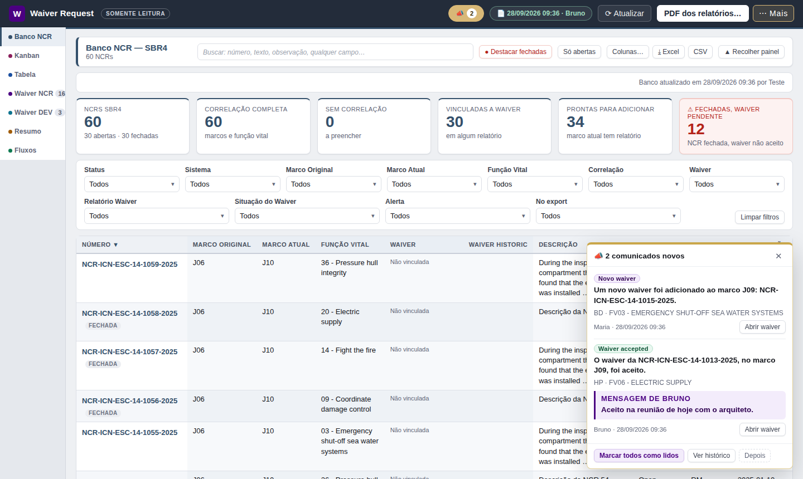

## 5. A tela, parte por parte

### A barra de cima

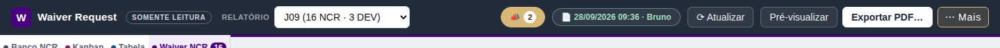

| Elemento | Para que serve |
| --- | --- |
| **SOMENTE LEITURA** | lembra que este é o visualizador: nada aqui altera os relatórios |
| **Relatório** | escolhe o relatório (o marco) mostrado nas abas **Waiver NCR** e **Waiver DEV**. Entre parênteses, quantas NCRs e DEVs ele tem. Nas abas que olham todos os marcos (Banco NCR, Kanban, Tabela, Resumo) ele some, porque lá não se aplica |
| **📣 2** | os comunicados da equipe; o número é quantos você ainda não leu (seção 9) |
| **📄 data · nome** | de quando é a publicação que você está vendo, e quem publicou. Clique para ver os detalhes (seção 6) |
| **⟳ Atualizar** | lê a publicação na hora, sem esperar os 5 minutos |
| **Pré-visualizar** | mostra as folhas do PDF do relatório aberto, exatamente como vão sair |
| **Exportar PDF…** | gera o PDF do *Waiver Request* (seção 10). Nas abas de tela cheia ele se chama **PDF dos relatórios…** |
| **⋯ Mais** | diagnóstico, contador da atualização automática e o histórico de comunicados |

### As abas (lado esquerdo)

Na ordem em que aparecem, cada uma com a sua cor:

**Banco NCR · Kanban · Tabela · Waiver NCR · Waiver DEV · Resumo · Fluxos**

O número ao lado de *Waiver NCR* e *Waiver DEV* é quantos itens o relatório
aberto tem. Com o teclado: as **setas** andam entre as abas, **Home** vai à
primeira e **End** à última.

### O menu ⋯ Mais

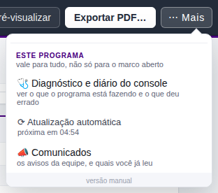

- **🩺 Diagnóstico e diário do console** — o que o programa está fazendo, e o
  botão *Copiar para um e-mail* para pedir ajuda (seção 14).
- **⟳ Atualização automática — próxima em 04:57** — quanto falta para a
  próxima leitura automática.
- **📣 Comunicados** — o histórico de todos os avisos.
- No pé, a **versão** do programa.

## 6. De onde vêm os dados, e quando se atualizam

O visualizador **não lê o banco de dados da equipe diretamente**. Quem edita
**publica** um retrato dos dados no arquivo
`00_BD_VISUALIZADOR\visualizador-dados.js`, e o visualizador lê esse retrato.

```
  Equipe de derrogação               Pasta da rede                    Você
 ┌──────────────────────┐   publica   ┌─────────────────────────┐  lê   ┌──────────────┐
 │  editor (derrogacao. │ ──────────▶ │ 00_BD_VISUALIZADOR\     │ ────▶ │ visualizador │
 │  html)               │             │   visualizador-dados.js │       │ (só leitura) │
 └──────────────────────┘             └─────────────────────────┘       └──────────────┘
```

**Quando os dados mudam na sua tela:**

- **Na abertura** — sempre a publicação mais recente.
- **Sozinho, a cada 5 minutos**, enquanto a janela estiver aberta. O que você
  está vendo (o relatório, a aba, o item aberto) continua na tela; só o
  conteúdo é trocado. Quando chega coisa nova, aparece no pé da tela
  *“Dados atualizados: publicação de …, por …”*.
- **Na hora, com ⟳ Atualizar.** Se não houver nada novo, o programa diz
  *“Nenhuma publicação nova — os dados continuam os de …”*.
- Com a janela **minimizada ou em outra aba** do navegador, nada é lido. Ao
  voltar, se os 5 minutos já tiverem passado, ele lê na hora.
- Com uma janela aberta por cima (a de exportar, por exemplo), a leitura
  espera alguns segundos para não mexer na tela enquanto você usa.

> **O visualizador mostra o que foi publicado, não o que está sendo digitado
> agora.** Normalmente o editor publica sozinho alguns minutos depois de cada
> alteração. Se algo que um colega acabou de mudar ainda não apareceu, espere
> alguns minutos e clique em ⟳ Atualizar. Antes de discutir um dado, **olhe a
> data na etiqueta 📄**.

### A etiqueta 📄 e a janela “Dados deste visualizador”

| Cor da etiqueta | Quer dizer |
| --- | --- |
| **Verde** | dados lidos da publicação; atualizam sozinhos |
| **Amarela** | dados de um arquivo aberto à mão: valem até fechar a página e **não** se atualizam |
| **Vermelha** | nenhum dado carregado, ou a última releitura falhou (o que está na tela é da leitura anterior) |

Clicando nela:

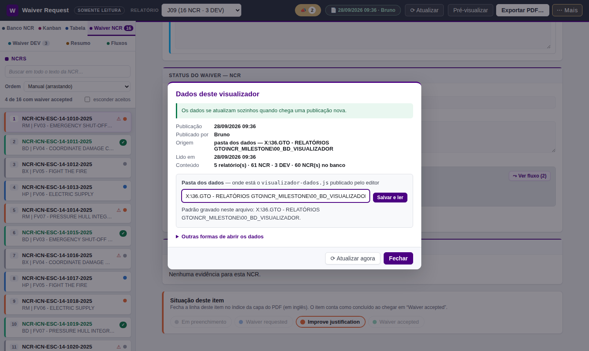

- **Publicação / Publicado por / Lido em** — de quando é o retrato e quando o
  seu visualizador o leu.
- **Origem** — de onde os dados vieram (a pasta dos dados, o arquivo ao lado
  do visualizador ou um arquivo aberto à mão).
- **Conteúdo** — quantos relatórios, NCRs, DEVs e NCRs do banco vieram.
- **Pasta dos dados** — o caminho onde o visualizador procura o
  `visualizador-dados.js`. O padrão já vem gravado no arquivo
  (`X:\36.GTO - RELATÓRIOS GTO\NCR_MILESTONE\00_BD_VISUALIZADOR`).
  **Só mude se a sua unidade de rede tiver outra letra** — veja a seção 13.
  O que você informar vale só para o seu navegador; **Voltar ao padrão do
  arquivo** desfaz.
- **⟳ Atualizar agora** — o mesmo botão da barra.

## 7. As situações do waiver e o que cada cor quer dizer

Todo item (NCR ou DEV) de um relatório tem uma **situação**, que é o
acompanhamento da equipe. São quatro, sempre nesta ordem:

| Situação | Cor | Quer dizer |
| --- | --- | --- |
| **Em preenchimento** (*Under preparation* no PDF) | cinza | o pedido ainda está sendo escrito |
| **Waiver requested** | azul | enviado ao arquiteto, aguardando resposta |
| **Improve justification** | laranja | voltou pedindo justificativa melhor |
| **Waiver accepted** | verde, com ✓ | aceito. **Só esta conta como concluída** |

As mesmas cores valem em todas as telas: a barra à esquerda de cada item na
lista, as colunas do Kanban, os gráficos do Resumo, as etiquetas do Banco NCR.

Outros sinais que você vai ver:

| Sinal | Onde | Quer dizer |
| --- | --- | --- |
| **⚠** (vermelho) | lista de itens, Kanban, Banco NCR, item aberto | **NCR fechada com waiver pendente**: a NCR já está fechada no banco NCR, mas o waiver dela ainda não está em *Waiver accepted*. Vale conferir com a equipe se o waiver ainda é necessário ou se falta atualizar a situação |
| **⤵** | lista de itens | o item foi trazido de um marco anterior e ainda está sendo revisado para este marco |
| **FECHADA** | Banco NCR | a NCR está encerrada no banco (*Closed*, *CEDOC Closure*…) |
| **(J09)** entre parênteses, tracejado | caminho do waiver | para onde o waiver aponta e **ainda não foi levado** |

> **Situação × Arch Status.** A *situação* é o acompanhamento da equipe
> (sempre uma das quatro). O **Arch Status Waiver** é um campo de texto do
> documento, escrito à mão, e pode estar em branco. No índice da capa do PDF,
> cada linha termina com a **situação**; o Arch Status aparece na página do
> item.

## 8. As áreas (abas)

### 8.1 Waiver NCR e Waiver DEV — o relatório de um marco

É o relatório de *Waiver Request* do marco escolhido em **Relatório** (na
barra de cima). **Waiver NCR** mostra as NCRs; **Waiver DEV**, os desvios.

**A lista (à esquerda):**

- **Buscar em todo o texto** — procura no número, no sistema, na função, nos
  cinco blocos de texto, no Arch Status, nos certificados e até nas legendas
  das fotos.
- **Ordem** — Manual, Número, Sistema, Função ou Situação. No visualizador a
  ordem escolhida vale **só para a sua tela** (e para o PDF que você gerar
  dali); não muda nada para os outros.
- **“4 de 16 com waiver accepted”** — o progresso do relatório.
- **esconder aceitos** — mostra só o que ainda falta.
- Cada item mostra o número, o sistema e a função; a **cor da barra** é a
  situação (seção 7).

**O item aberto (à direita)** mostra tudo o que vai no documento, na mesma
ordem do PDF:

1. **Identificação** — número, sistema(s), função e o título gerado. Se a NCR
   estiver no banco NCR, aparece uma faixa com o status dela no banco e o
   botão **Ver a ficha**; se ela estiver fechada com o waiver pendente, o
   aviso **⚠** em vermelho.
2. **Conteúdo da derrogação** — *Description*, *Current Situation*, *Why is
   not possible to treat the deviation*, *What are the arguments for the
   derrogation* e *Arch Answer* (a resposta do arquiteto).
   **Recolher preenchidos** fecha os blocos para ver o resto mais rápido.
3. **Status do waiver** — *Waiver Request Expiry*, *Arch Status Waiver*,
   *Waiver Approved Expiry*, *Waiver Historic* e **o fluxo** desenhado a
   partir do histórico (por exemplo **J08 → J09**). **⤳ Ver fluxo** abre o
   desenho grande.
4. **Certificate Impacted** e **Evidências** (as imagens anexadas, que no PDF
   viram páginas de anexo).
5. **Situação deste item** — a situação atual (só para ver; no visualizador
   ela não muda).

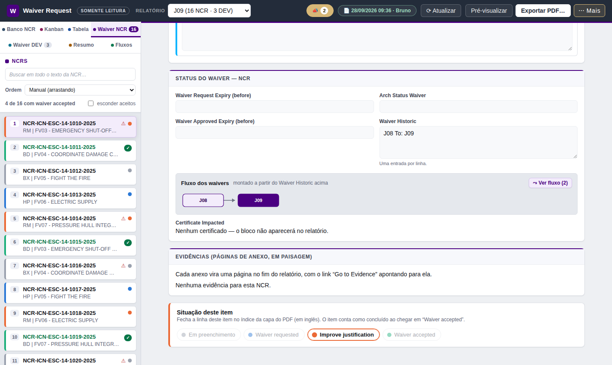

**Dicas:**

- Você pode **selecionar e copiar** qualquer texto dos campos.
- **⇥ Ver outra ao lado** abre, numa coluna à direita, outro item (deste
  marco ou de outro) para comparar — por exemplo a mesma NCR no J08 e no J09.
- No fluxo, um card com um **ponto no canto** tem resposta de outro marco:
  passe o mouse para ler o *Arch Answer* daquele marco; clique para abrir o
  item de lá.
- **Pré-visualizar** mostra as folhas do PDF deste relatório.

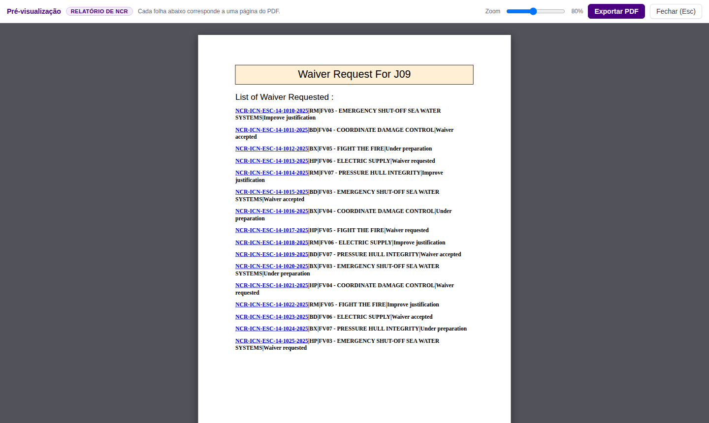

### 8.2 Banco NCR — todas as NCRs do SBR4

Todas as NCRs do **SBR4** importadas do banco NCR (o mesmo export que o NCR
Control usa), com os campos que a equipe de derrogação acrescenta: **Marco
Original**, **Marco Atual**, **Função Vital**, **Waiver Historic** e
**Observação**.

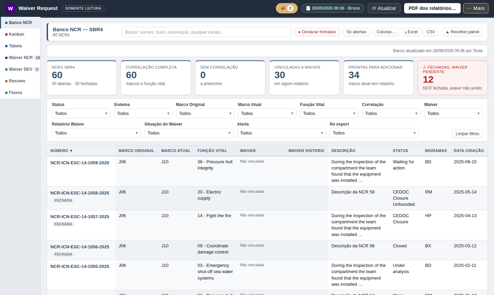

- **Cartões de números** no alto: total de NCRs (abertas × fechadas),
  correlação, quantas estão vinculadas a um relatório de waiver e
  **⚠ Fechadas, waiver pendente**. Clicar num cartão filtra a tabela.
- **Busca** em qualquer campo, **● Destacar fechadas** (pinta de vermelho as
  encerradas) e **Só abertas**.
- **Filtros de múltipla escolha**: Status, Sistema, Marco Original, Marco
  Atual, Função Vital, Correlação, Waiver, Relatório Waiver, Situação do
  Waiver, Alerta e *No export*. **Limpar filtros** volta a mostrar tudo.
- **Coluna Waiver** = o caminho da NCR pelos relatórios, por exemplo
  `J06 → J08 → (J09)`, cada etiqueta com a cor da situação naquele marco.
  Clicar na etiqueta abre o item.
- **Colunas…** escolhe e reordena as colunas (dá para arrastar o título da
  coluna). **▲ Recolher painel** esconde os números e filtros para ver mais
  linhas.
- A data do retrato do banco aparece no alto: *“Banco atualizado em … por
  …”*.

**A ficha da NCR** — clique no número:

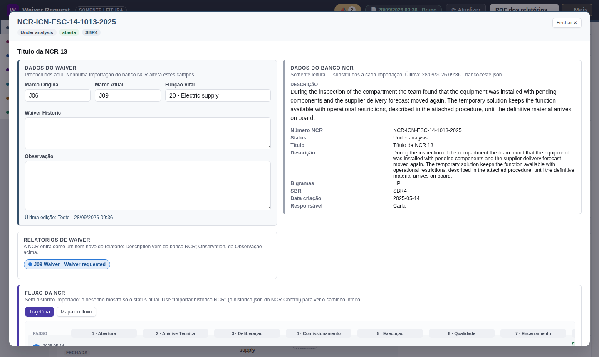

- **Dados do Waiver** (os campos da equipe) e **Relatórios de Waiver** em que
  a NCR está, com a situação de cada um (clique para abrir);
- **Dados do banco NCR** — todas as colunas do export;
- **Fluxo da NCR**, como no NCR Control: **Trajetória** (passo a passo, com os
  dias em cada etapa) e **Mapa do fluxo**;
- o **histórico** de eventos.

**Fechar ✕** (ou Esc) volta à tabela.

### 8.3 Kanban — as NCRs de um marco, por situação

O quadro de **um marco**. Escolha o marco nas pastilhas do alto (J06, J08,
**J09**…); o número em cada uma é quantas NCRs ele tem.

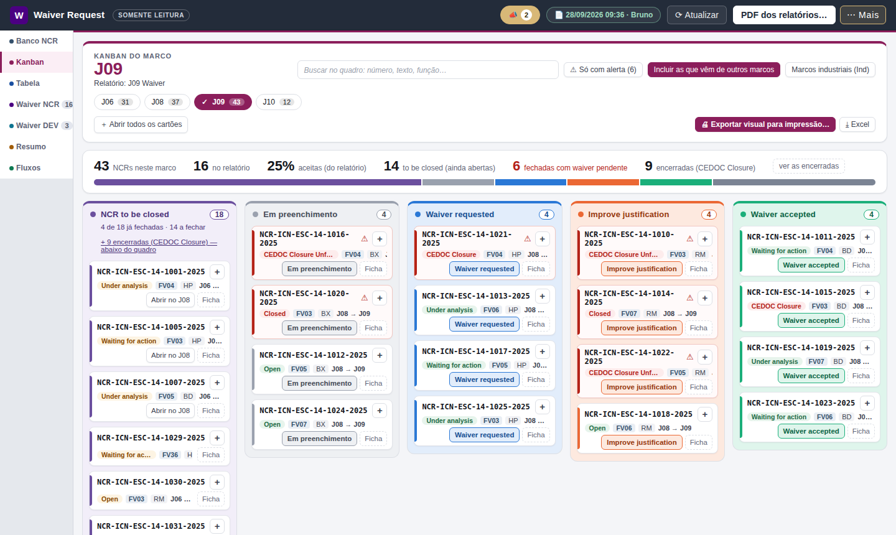

| Coluna | O que entra |
| --- | --- |
| **NCR to be closed** | NCRs do marco que **não estão no relatório de waiver dele**. Sem waiver, elas precisam ser **fechadas até o marco**. Aqui a lógica se inverte: status **fechada fica verde (✓)** e a aberta fica em âmbar; as abertas vêm primeiro. O alto da coluna diz quantas já foram fechadas e quantas faltam |
| **Em preenchimento** · **Waiver requested** · **Improve justification** · **Waiver accepted** | os itens do relatório de waiver do marco, pela situação |
| **Encerradas — CEDOC Closure** (abaixo do quadro) | as NCRs de “NCR to be closed” já encerradas em *CEDOC Closure*. Clique em **ver as encerradas** para abrir a área |

- **A faixa de números** resume o marco: NCRs no marco, no relatório, % aceitas,
  *to be closed*, fechadas com waiver pendente e encerradas.
- **Busca**, **⚠ Só com alerta**, **Incluir as que vêm de outros marcos**
  (itens de marcos anteriores cujo waiver vale até este) e **Marcos
  industriais (Ind)** — os marcos *Ind* ficam escondidos por padrão e nunca
  são somados ao marco sem *Ind*.
- **Cartão**: número, status da NCR no banco, função vital (`FV03`), sistema e
  caminho. O **+** abre a descrição inteira e quem mexeu por último;
  **＋ Abrir todos os cartões** abre todos.
- **Ficha** abre a ficha da NCR; **Abrir no J08** (ou o marco em que ela está)
  abre o item no relatório.
- No visualizador o quadro **não arrasta** e a situação **não muda**.

### 8.4 Tabela — todos os itens de todos os marcos

Uma linha por item de **todos os relatórios** publicados, NCR e DEV juntos. É
a tela para responder *“onde está a NCR-…?”* sem abrir marco por marco.

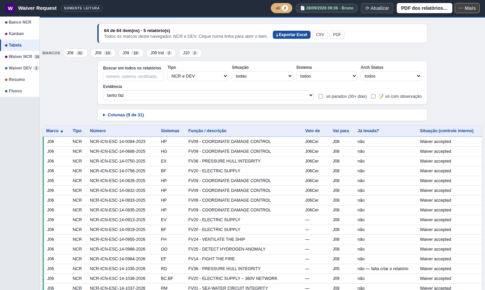

- **Marcos, em pastilhas** — clique em um ou vários (J08 **e** J09, por
  exemplo). Sem nenhum marcado, mostra todos.
- **Buscar em todos os relatórios** — varre todo o texto do item.
- **Filtros**: Tipo, Situação, Sistema, Arch Status, Evidência, *só parados
  (30+ dias)*.
- **As colunas da trajetória**, lidas ao lado de *Marco*:

  | Veio de | Marco | Vai para | Já levada? |
  | --- | --- | --- | --- |
  | J06 | J08 | J09 | não |

  *Veio de* sai do Waiver Historic; *Vai para* sai do *Waiver Approved Expiry*
  (ou do *Request Expiry*, se ainda não houve aprovação); *Já levada?* diz se
  a cópia já existe no relatório do marco de destino. Na coluna *Caminho do
  waiver*, o que está **entre parênteses ainda não aconteceu**:
  `J04 → J06 → J08 → (J09)`.
- **Colunas (9 de 31)** — escolha as colunas e a ordem delas (↑ ↓). **Mostrar
  todas** traz o texto inteiro do waiver, inclusive o que está escrito nos
  anexos. A escolha fica guardada no seu navegador.
- **Clique no título** de uma coluna para ordenar; **clique numa linha** para
  abrir o item no relatório dele.

### 8.5 Resumo — números e gráficos

No alto, **um cartão por marco** (e *Todos os marcos*), cada um com o total de
itens, a % aceita e a divisão NCR/DEV. Clique para escolher; o escolhido tem
✓. Abre no **J09**.

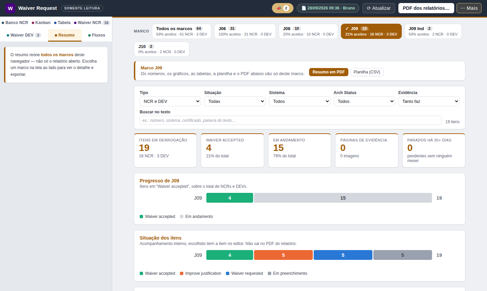

- **Filtros**: Tipo, Situação, Sistema, Arch Status, Evidência e busca no texto.
  Os números, os gráficos e as exportações passam a contar **só o que está
  filtrado**.
- **Números**: itens em derrogação, *waiver accepted*, em andamento, páginas de
  evidência e **parados há 30+ dias** (pendentes em que ninguém mexe há um mês).
- **Gráficos**: progresso por marco, situação dos itens, itens por sistema; a
  tabela de marcos; e, com um marco escolhido, a lista completa dos itens e a
  contagem por certificado.
- **Resumo em PDF** e **Planilha (CSV)** do que está na tela (seção 10).

### 8.6 Fluxos — por onde o waiver passou, e o que está chegando

O **Waiver Historic** de cada item é lido como setas (`J06 To: J08`) e
desenhado como um caminho (**J06 → J08**).

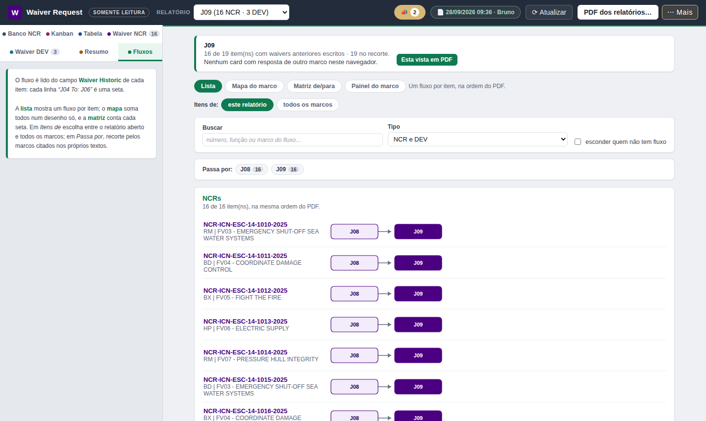

Quatro leituras:

| Vista | Responde |
| --- | --- |
| **Lista** | o caminho de cada item, na ordem do PDF |
| **Mapa do marco** | todos os caminhos somados num desenho: a seta engorda com o número de itens que passam por ela |
| **Matriz de/para** | cada seta escrita, da mais usada para a menos, com o percentual |
| **Painel do marco** | **o que está chegando no marco** (J09, por exemplo): quantos itens vêm, de onde, quantos já estão aceitos, **já no relatório do J09** × **aceitos, falta trazer**, e a lista item a item. É a vista para levar à reunião |

- **Itens de**: *este relatório* (o escolhido em **Relatório**) ou *todos os
  marcos*.
- **Buscar**, **Tipo**, *esconder quem não tem fluxo* e **Passa por** (clique
  nos marcos para ver só quem passa por eles).
- **Esta vista em PDF** gera em A4 exatamente o que está na tela.

## 9. Comunicados da equipe

Alguns acontecimentos do **J09** merecem aviso, e quem edita decide, com um
clique, quando comunicar:

| Comunicado | Exemplo |
| --- | --- |
| **Novo waiver** | “Um novo waiver foi adicionado ao marco J09: NCR-…” |
| **Nova NCR** | “Uma nova NCR foi adicionada ao marco J09: NCR-…” |
| **Waiver accepted** | “O waiver da NCR-…, no marco J09, foi aceito.” |

Pode vir junto uma **mensagem** de quem comunicou, em destaque (*“Mensagem de
Bruno”*).

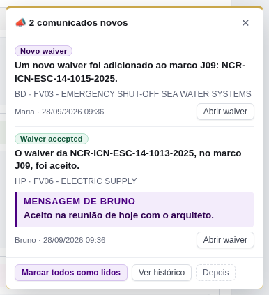

**Como aparecem:** num **pop-up no canto de baixo**, que não bloqueia a tela.
Vários de uma vez aparecem numa lista só. Chegam na abertura, a cada 5 minutos
e no ⟳ Atualizar.

| Botão | O que faz |
| --- | --- |
| **Abrir waiver** / **Ver NCR** | leva direto ao item ou à ficha da NCR (e conta como lido) |
| **Marcar como lido** / **Marcar todos como lidos** | não aparece mais como novo neste navegador |
| **Ver histórico** | abre a lista de todos os comunicados |
| **Depois** (ou ✕) | fecha agora; volta na próxima vez que você abrir o visualizador |

- A etiqueta **📣** na barra de cima mostra quantos faltam ler e abre o
  **histórico** (também em **⋯ Mais → 📣 Comunicados**).
- Só vira pop-up o comunicado **não lido de até 4 dias**. Os mais antigos
  continuam no histórico — quem volta de férias não recebe uma pilha de
  avisos.
- O que você marcou como lido fica guardado **no seu navegador**. Em outro
  computador (ou outro navegador) eles podem aparecer de novo.

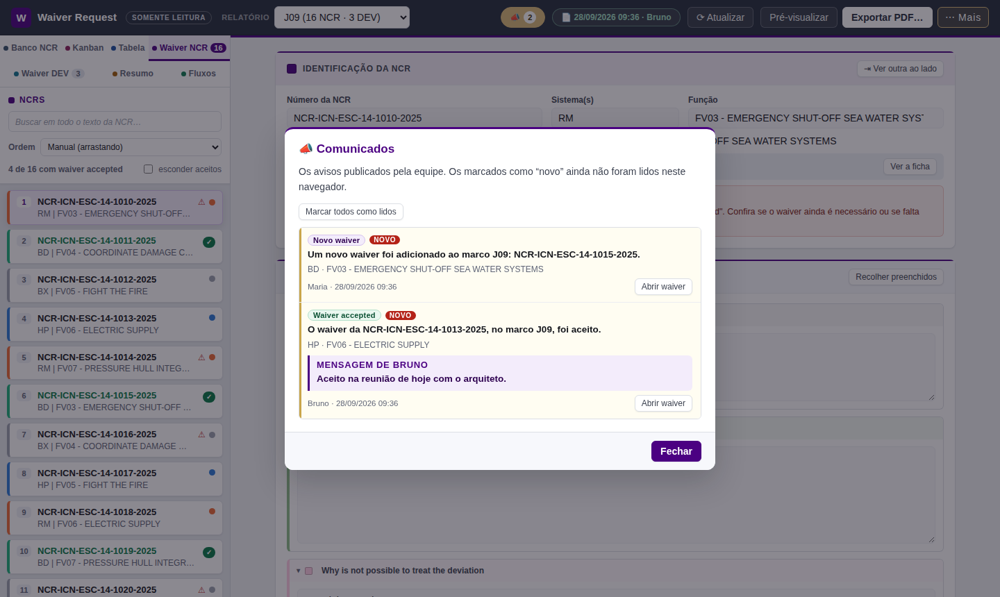

## 10. Exportar: PDF, Excel e CSV

O visualizador exporta **tudo o que o editor exporta**. Os arquivos são
gerados no seu computador; nada é enviado a lugar nenhum.

### O PDF do relatório (*Waiver Request*)

É o mesmo documento que a equipe gera: capa com o índice, uma página por item
e as páginas de anexo em paisagem.

1. **Exportar PDF…** (ou **Ctrl + P**) — em abas de tela cheia o botão se
   chama **PDF dos relatórios…**.
2. Em **Relatórios**, marque um (gera o arquivo dele) ou vários — ou **Marcar
   todos** — para um arquivo único com todos em sequência.
3. Em **Situação dos itens**, se quiser **só uma parte** (por exemplo só os
   *Waiver requested*), clique nas pastilhas. **Todas as situações** volta ao
   relatório inteiro. Com recorte, **a capa avisa** que é uma lista parcial.
4. A janela diz, antes de gerar, **quantas folhas** vão sair.
5. **Gerar PDF** abre a janela de impressão do navegador. Ajuste **assim**:

    | Opção | Valor |
    | --- | --- |
    | Destino | **Salvar como PDF** |
    | Margens (em *Mais configurações*) | **Nenhuma** |
    | Gráficos de plano de fundo | **marcado** |
    | Cabeçalhos e rodapés | **desmarcado** |

6. **Salvar** e escolha a pasta.

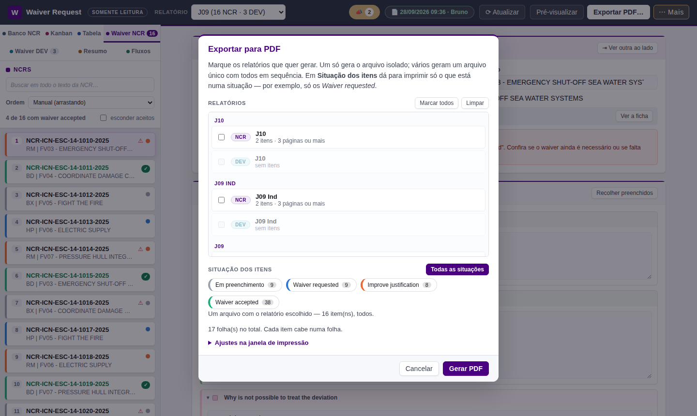

> As margens certas já estão no documento — por isso **Margens: Nenhuma**. Com
> outra opção o conteúdo encolhe ou sai deslocado; sem *Gráficos de plano de
> fundo* as faixas coloridas somem.

### As outras exportações

| Onde | Botão | O que sai |
| --- | --- | --- |
| **Resumo** | **Resumo em PDF** / **Resumo geral em PDF** | números, gráficos e a lista de itens do marco escolhido (ou de todos), com o recorte dos filtros escrito na folha |
| **Resumo** | **Planilha (CSV)** | uma linha por item, com todos os campos (abre no Excel) |
| **Tabela** | **⤓ Exportar Excel** | `.xlsx` com o que está **à vista** (colunas, filtros, ordem), filtro no cabeçalho, 1ª linha congelada, e a aba **Recorte** dizendo o filtro usado |
| **Tabela** | **CSV** / **PDF** | a mesma tabela; o PDF sai deitado quando há muitas colunas |
| **Kanban** | **🖨 Exportar visual para impressão…** | o quadro em PDF, A4 ou A3, retrato ou paisagem, “caber na largura” ou “caber numa folha só”; a janela avisa quantas folhas e o tamanho da letra. Na impressão: **Salvar como PDF**, margens **Nenhuma** |
| **Kanban** | **⤓ Excel** | uma linha por NCR do quadro, com a aba **Recorte** |
| **Banco NCR** | **⤓ Excel** / **CSV** | as NCRs e colunas à vista, com a aba **Recorte** |
| **Fluxos** | **Esta vista em PDF** | a lista, o mapa, a matriz ou o painel do marco, em A4 |

> **As planilhas saem com o que está à vista.** Para exportar o total, limpe
> os filtros antes. A aba **Recorte** existe justamente para ninguém ler uma
> planilha filtrada como se fosse o total.

## 11. O que o visualizador não faz

- **Não edita nada**: nenhum campo aceita digitação, a situação não muda, o
  Kanban não arrasta.
- **Não cria, não exclui, não importa, não faz backup.**
- **Não grava nada** — nem no navegador, nem em pasta nenhuma. As únicas
  coisas que ele guarda no seu navegador são preferências de tela (colunas
  escolhidas, a pasta dos dados se você informar outra) e quais comunicados
  você já leu.
- **Não tem a aba Conversa** da equipe.
- **Não mostra a anotação interna** que a equipe deixa em cada item (ela não é
  publicada).
- **Não mostra o que ainda não foi publicado** (seção 6).

**Encontrou um erro num waiver, ou precisa de uma mudança?** Fale com a
equipe de derrogação — quem tem o editor é quem altera. Diga o **marco**, o
**número** do item e o que está errado; se possível, a data da publicação
que você estava vendo (a etiqueta 📄).

## 12. Deve e não deve: regras de uso

O conteúdo é **material de programa de defesa**. O visualizador foi feito para
que nada saia do computador; o resto depende de quem usa.

**Deve:**

- ✅ Abrir o visualizador **sempre da pasta `NCR_MILESTONE`** (ou por um atalho
  para ela).
- ✅ **Olhar a data da publicação** (etiqueta 📄) antes de tirar conclusões ou
  repassar um dado.
- ✅ Usar **⟳ Atualizar** antes de gerar um PDF ou uma planilha para uma
  reunião.
- ✅ Conferir a **aba Recorte** (planilhas) e o aviso da capa (PDF) quando
  exportar com filtro.
- ✅ Guardar PDFs e planilhas exportados **nas pastas da rede da empresa**, com
  o mesmo cuidado dos relatórios originais.
- ✅ Avisar a equipe quando encontrar algo estranho (seção 14).

**Não deve:**

- ❌ Abrir, mover, renomear ou apagar o **`visualizador-dados.js`** (e nada
  dentro de `00_BD_VISUALIZADOR`).
- ❌ Copiar o `visualizador-dados.js` ou os PDFs/planilhas para **pendrive,
  e-mail externo, nuvem pessoal ou computador pessoal**. O arquivo de dados
  tem o conteúdo completo dos relatórios publicados e do banco NCR.
- ❌ Usar o endereço do site na internet para o visualizador (ele não lê a
  rede — seção 4).
- ❌ Tratar o visualizador como controle de acesso: **quem garante que só a
  equipe edita é a permissão das pastas da rede**, não o programa.

## 13. Problemas comuns e o que fazer

### “Não foi possível ler os dados.”

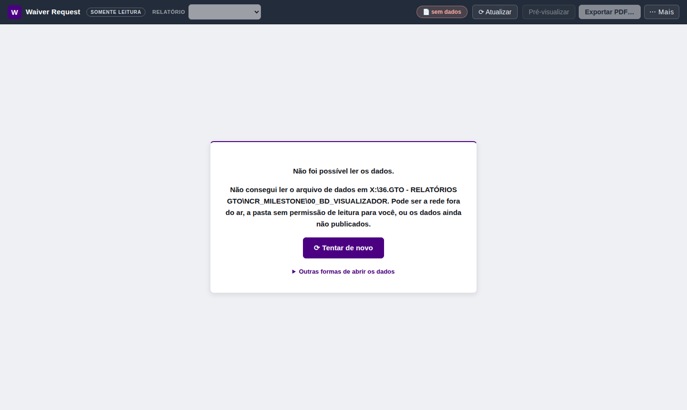

O visualizador não achou o `visualizador-dados.js`. Tente, nesta ordem:

1. **⟳ Tentar de novo** — a rede pode ter oscilado.
2. Abra `X:\36.GTO - RELATÓRIOS GTO\NCR_MILESTONE\00_BD_VISUALIZADOR` no
   Explorador de Arquivos:
   - **a unidade `X:` não existe** ou a pasta está em outra letra → vá ao
     item 3;
   - **“Acesso negado”** → você não tem permissão de leitura: peça o acesso
     (seção 14);
   - **a pasta abre, mas o `visualizador-dados.js` não está lá** → os dados
     ainda não foram publicados: avise a equipe.
3. **Informe o caminho certo** (uma vez só): clique em **Outras formas de
   abrir os dados** → **Informar a pasta dos dados…** (ou na etiqueta **📄**),
   escreva o caminho da pasta `00_BD_VISUALIZADOR` como ele aparece no **seu**
   computador — por exemplo
   `G:\36.GTO - RELATÓRIOS GTO\NCR_MILESTONE\00_BD_VISUALIZADOR` — e clique em
   **Salvar e ler**. Dica: no Explorador, clique na barra de endereço da
   pasta, **Ctrl + C**, e cole no campo. Vale também o caminho de rede
   completo (`\\servidor\...`), se o TI informar.
4. **Último recurso** (dados de um dia, sem atualização): **Abrir arquivo…** e
   escolha o `visualizador-dados.js` (ou arraste o arquivo para a janela). Ele
   é lido como texto — nada é executado —, vale até fechar a página e **não se
   atualiza sozinho** (etiqueta 📄 amarela).

### Faixa amarela: “Não foi possível ler a publicação mais recente…”

Os dados já estavam na tela e a releitura falhou (rede fora do ar, por
exemplo). **O que está à vista continua valendo**, mas pode estar
desatualizado — a faixa diz de quando é. Clique em **⟳ Atualizar** quando a
rede voltar. O programa também tenta sozinho a cada 5 minutos.

### Faixa amarela: “Não consegui ler a pasta dos dados (…). O que está à vista veio do arquivo ao lado deste visualizador.”

O caminho da pasta dos dados não respondeu, mas havia um
`visualizador-dados.js` ao lado do `.html`, e foi ele que o programa usou.
Esse arquivo ao lado pode estar **velho**. Confira a data na etiqueta 📄 e
avise a equipe.

### Os dados parecem velhos

- Confira a data na etiqueta **📄**: é o momento da última publicação.
- Clique em **⟳ Atualizar**.
- Se a data não muda há muito tempo, a publicação automática do editor pode
  estar desligada — avise a equipe.

### Aparece “Este visualizador é mais antigo que os dados publicados”

A equipe atualizou o programa e o seu visualizador é de uma versão anterior.
Se você abre por **atalho** para a pasta `NCR_MILESTONE`, feche e abra de novo
(ou **Ctrl + F5**). Se abre uma **cópia** na sua máquina, apague-a e crie um
atalho para o arquivo da pasta (seção 4).

### O PDF sai com margens estranhas, sem cores ou com data e endereço no canto

Ajuste a janela de impressão: **Margens: Nenhuma**, **Gráficos de plano de
fundo: marcado**, **Cabeçalhos e rodapés: desmarcado** (seção 10).

### O pop-up de comunicados não aparece mais

Ele só mostra os **não lidos de até 4 dias**. Os outros estão em **📣** (na
barra) ou **⋯ Mais → 📣 Comunicados**. Se você clicou em *Depois*, eles voltam
na próxima abertura.

### “A NCR-… não está no relatório do J09 desta publicação”

O comunicado fala de um item que não veio na publicação atual (foi removido
ou renumerado depois). Clique em ⟳ Atualizar; se continuar, avise a equipe.

### O item que eu procuro não aparece

- Na lista do relatório: veja se **esconder aceitos** está marcado e se há
  texto na **busca**.
- Confira se está no **relatório (marco) certo** — ou use a aba **Tabela**,
  que procura em todos os marcos.
- Nos marcos industriais: no Kanban, ligue **Marcos industriais (Ind)**.

### Tela em branco ou tudo desarrumado

Feche e abra de novo o visualizador pela pasta `NCR_MILESTONE`. Confirme que
está no **Edge ou Chrome**. Se continuar, use o diagnóstico (seção 14).

## 14. Pedir ajuda

1. **⋯ Mais → 🩺 Diagnóstico e diário do console → Copiar para um e-mail.**
   Isso copia um retrato técnico do programa (versão, de onde vieram os dados,
   o que deu errado). **O texto das NCRs nunca entra nesse retrato** — só
   contagens, nomes de campo e mensagens de erro.
2. Cole num e-mail **interno** para a equipe de derrogação (hoje, o
   **Bruno**), junto com: o que você estava tentando fazer, o que apareceu na
   tela (um *print* ajuda) e a data da etiqueta 📄.
3. **Acesso à pasta** (“Acesso negado”): peça ao responsável pela pasta
   `36.GTO - RELATÓRIOS GTO` permissão de **leitura** em `NCR_MILESTONE` e
   `00_BD_VISUALIZADOR`.

## 15. Perguntas frequentes

**Posso estragar alguma coisa usando o visualizador?**
Não. Nenhuma tela grava nada, e os dados vêm de uma cópia publicada — não do
banco de trabalho da equipe.

**Preciso fechar e abrir para ver as atualizações?**
Não. Ele relê sozinho a cada 5 minutos, e **⟳ Atualizar** lê na hora.

**Por que o que um colega acabou de mudar ainda não apareceu?**
Porque o visualizador mostra a última **publicação**, que o editor faz
alguns minutos depois de cada alteração. Espere um pouco e clique em
⟳ Atualizar.

**Posso deixar o visualizador aberto o dia inteiro?**
Pode. Ele se atualiza sozinho e mantém o relatório, a aba e o item que você
está vendo.

**O PDF que eu gero é o oficial?**
É o mesmo documento que o editor gera, com os dados da publicação que você
está vendo. Antes de mandar para alguém, clique em ⟳ Atualizar e confira a
data na etiqueta 📄. Com recorte por situação, a capa avisa que é parcial.

**Por que abre no J09?**
O J09 é o marco da vez. Para ver outro, escolha em **Relatório** (abas Waiver)
ou nas pastilhas de marco (Kanban, Tabela, Resumo).

**O que é “J09 Ind”?**
O marco industrial correspondente. É tratado como **outro** marco: nada dele é
somado ao J09. No Kanban fica escondido até você ligar **Marcos industriais
(Ind)**.

**Posso usar no celular ou em casa?**
Não. O visualizador lê a pasta da rede da empresa, e o conteúdo não deve sair
dos computadores da empresa.

**Posso usar o Firefox?**
Use o **Edge** ou o **Chrome** — são os testados.

**Alguém consegue ver o que eu consultei?**
Não. O visualizador não registra nem envia o que você abre. O que fica no seu
navegador são só as suas preferências de tela e os comunicados que você já
leu.

**Como peço acesso para editar?**
O editor é usado pela equipe de derrogação. Fale com o Bruno.

## 16. Glossário

| Termo | Significado |
| --- | --- |
| **NCR** | *Non-Conformity Report* — relatório de não conformidade |
| **DEV** | desvio (*deviation*) — mesmo formato de waiver, relatório próprio |
| **Waiver / derrogação** | pedido para seguir com a não conformidade até um marco, com justificativa |
| **Marco** (J06, J08, J09…) | etapa do programa. Cada marco tem o seu relatório de waiver |
| **J06Cer**, **J09 Ind** | marcos distintos do J06 e do J09 (certificação; industrial) |
| **RANAE**, **TRAP** | os marcos depois do J12 |
| **Arch Answer** | a resposta do arquiteto ao pedido |
| **Arch Status Waiver** | o status escrito no documento pelo arquiteto (texto livre) |
| **Waiver Request Expiry** | até que marco a equipe **pediu** o waiver |
| **Waiver Approved Expiry** | até que marco o waiver foi **aprovado** |
| **Waiver Historic** | por onde o waiver já passou (`J06 To: J08`), uma linha por passo |
| **Situação** | o acompanhamento da equipe: Em preenchimento, Waiver requested, Improve justification, Waiver accepted |
| **Marco Original / Marco Atual** | o marco em que a NCR nasceu / o marco em que ela está agora |
| **Função Vital (FV)** | a função do submarino afetada (`FV09 - Coordinate damage control`) |
| **CEDOC Closure** | status de NCR encerrada no banco NCR |
| **NCR to be closed** | NCR do marco sem waiver no relatório dele: precisa ser fechada até o marco |
| **Publicação** | o retrato dos dados que o editor grava para o visualizador (`visualizador-dados.js`) |
| **Recorte** | o filtro aplicado numa exportação; vai escrito no arquivo |

---

## 17. Para quem administra o visualizador

*Esta parte é para a equipe que edita (o Bruno). Quem só visualiza pode
parar na seção 16.*

**Montar a pasta (uma vez):**

1. Copie o `derrogacao-visualizador.html` (raiz do repositório, ou
   **⋯ Mais → 👁 Publicar para visualizadores → baixar o visualizador** no
   editor) para `X:\36.GTO - RELATÓRIOS GTO\NCR_MILESTONE\`. Copie também este
   manual em PDF para lá, se quiser.
2. No editor: **⋯ Mais → 👁 Publicar para visualizadores → Escolher a
   pasta…** e aponte `…\NCR_MILESTONE\00_BD_VISUALIZADOR`. Depois **Publicar
   agora** e ligue **Publicar sozinho** (republica no máximo a cada 2 minutos,
   e só se algo mudou).
3. Enquanto o editor não estiver ligado a essa pasta — nunca escolhida, sem
   permissão nesta sessão, ou a pasta parou de responder — ele mostra no alto
   um aviso com o caminho e o botão **Conectar agora**. A cada sessão o
   navegador pede a sua confirmação (um clique).

**Permissões da rede (é isto que garante o “somente leitura”):**

- visualizadores: **leitura** em `NCR_MILESTONE` e `00_BD_VISUALIZADOR`, e
  **nenhum acesso** à pasta do banco de dados da equipe
  (`G:\DOP\GTO\3_INTERNO\01_SAFE TO DIVE\10_SISTEMA DE DERROGAÇÃO\00_BD`);
- quem publica: **gravação** em `00_BD_VISUALIZADOR`.

**O que vai na publicação:** todos os relatórios com marco ou itens (inclusive
os *em preenchimento*), as imagens, a autoria de cada item, o banco NCR e os
comunicados. **Não vão:** sessões, histórico do texto, lápides de exclusão,
campos de controle da mesclagem e a anotação interna do item.

**Comunicados:** só nascem do botão **📣 Comunicar** no editor (barra de
situação do item, ficha da NCR ou o aviso logo depois de uma mudança), com
prévia. Os marcos que geram comunicado ficam em
`assets/js/config.js` (`MARCOS_COMUNICADOS`, hoje `['J09']`); o prazo de
novidade, em `DIAS_COMUNICADO_NOVO` (4 dias).

**O manual em PDF:** `python3 tools/manual-pdf.py MANUAL-VISUALIZADOR.pdf`
(precisa do pacote `markdown` do Python e do Edge ou Chrome). Cada capítulo
começa em folha nova e nenhuma seção é partida ao meio. Gere de novo sempre
que este arquivo mudar, e troque o PDF da pasta `NCR_MILESTONE`.

**Atualizar o visualizador:** a cada versão nova do programa, substitua o
`derrogacao-visualizador.html` da pasta `NCR_MILESTONE`. Quem usa atalho pega
a versão nova ao reabrir.

**Mudar a pasta dos dados:** o caminho padrão está em
`assets/js/config.js` (`PASTA_VISUALIZADOR`); depois de mudar, gere de novo o
arquivo único (`python3 tools/build-standalone.py`) e troque o `.html` da
pasta. Se a pasta do `.html` mudar, atualize também a seção 3 deste manual.

**Pontos ainda a confirmar no ambiente da empresa:**

- a leitura por caminho **UNC** (`\\servidor\…`) no Edge corporativo — o
  caminho por unidade mapeada (`X:\…`, com espaço e acento) foi conferido; o
  UNC não pôde ser testado fora da rede;
- se todos os visualizadores têm a pasta mapeada na mesma letra `X:`. Quem
  tiver outra letra informa o caminho uma vez (seção 13).

Detalhes técnicos: [`README.md`](README.md#visualizador-somente-leitura) e
[`CLAUDE.md`](CLAUDE.md) (§5, “O visualizador”).
